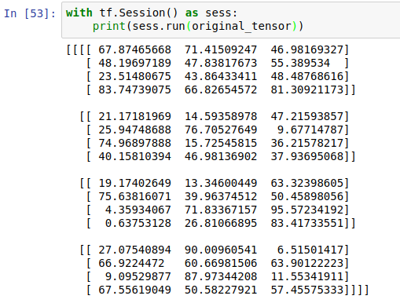

# tensorflow_unpooling
Unpooling of tensor that has been pooled using max_pool_with_argmax

Example Usage ::

1. Declare a tensor 
```python
original_tensor = tf.random_uniform([1,4,4,3],maxval=100,dtype='float32',seed=2)
```
2. Use the max pool with arg max function to pool the tensor
```python
pooled_tensor,max_indices=tf.nn.max_pool_with_argmax(original_tensor, ksize=[1,2,2,1], strides=[1,2,2,1], padding='SAME')
```
3. Now armed with ```pooled_tensor``` and ```max_indices```  you can call the ```unpool_with_argamx``` function !
```python
unpooled_tensor=unpool_with_with_argmax(pooled_tensor,max_indices)
```
4. It's done !

**Lets have a look at it**

1. **Original Tensor**


---
---
2. **Pooled Tensor**


---
---
3. **Max Indices**


---
---
4. **And finally the **Unpooled Tensor****
